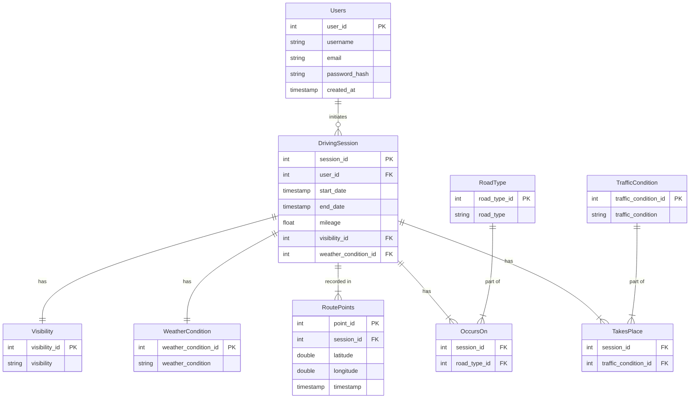

# Database Documentation & Entity Relationships

This document outlines the database structure, entity relationships, and schema details for the Extracker application.

## Entity Relationship Diagram (ERD)

The following diagram illustrates the relationships between the tables in the database.

## Table Descriptions

### Core Entities

#### `Users`
Stores user account information.
- **Relationships**: One User can have multiple `DrivingSession`s (1:N).

#### `DrivingSession`
Represents a single driving trip recorded by a user.
- **Relationships**:
  - Belongs to one `User`.
  - Has one `Visibility` condition.
  - Has one `WeatherCondition`.
  - Can have multiple `RoadTypes` (M:N via `OccursOn`).
  - Can have multiple `TrafficConditions` (M:N via `TakesPlace`).
  - Contains multiple `RoutePoints` (1:N) tracking the GPS path.

#### `RoutePoints`
Stores individual GPS coordinates for a session.

### Lookup Tables (Static Data)

- **`RoadType`**: Types of roads (e.g., Urban, Highway).
- **`TrafficCondition`**: Traffic density (e.g., Light, Heavy).
- **`WeatherCondition`**: Weather during the trip (e.g., Sunny, Rainy).
- **`Visibility`**: Visibility conditions (e.g., Clear, Low).

### Junction Tables (Many-to-Many Relationships)

- **`OccursOn`**: Links `DrivingSession` and `RoadType`. A trip can involve multiple road types (e.g., started on Urban, moved to Highway).
- **`TakesPlace`**: Links `DrivingSession` and `TrafficCondition`. A trip can experience varying traffic conditions.
